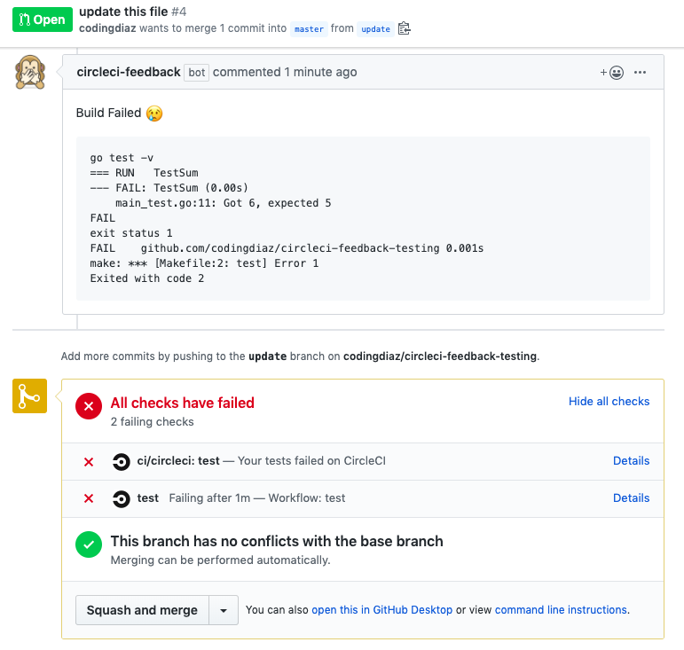

# circleci-feedback

A Github app that posts build logs from failed CircleCI jobs to Pull Requests.

For each pull request event, a webhook is sent to API Gateway, the request is authorized and ultimately an [AWS Step Function](https://aws.amazon.com/step-functions/) is started. The step function runs very simple logic with Lambda functions and uses step function features to run this as cheap as possible. 

Want to install it for yourself? [Start here](https://codingdiaz.github.io/circleci-feedback/getting_started/)

## Things to Note
* This currently uses two versions of the CircleCI API (v1.1 and the [beta 2.0 API](https://github.com/CircleCI-Public/api-preview-docs)) so, this is likely to change and is as reliable as these API's
* This polls CircleCI APIs and definetly isn't perfect as is, I didn't event think this would be too possible based on the limited CircleCI API but, this is the MVP
* A much simpler approach would be to curl some endpoint inside your CircleCI build on failures (it's possible to configure a job to run on failures of other jobs) but, from a user experience I didn't want to have users modify their CircleCI configuration to work
* This code is rough! But, this is my first opensource golang project, I a still learning for sure. 

## What's Next?

* Improvements to reduce the amount of API calls to CircleCI
* Improvements on the backoff logic to wait for a build to finish
* A Terraform deployment guide
* A least privledge IAM policy to deploy this application

## Props to Some Other Projects

I want to give a shoutout to some projects I used to create this,

* https://github.com/jszwedko/go-circleci
* https://github.com/bradleyfalzon/ghinstallation
* https://github.com/palantir/go-githubapp