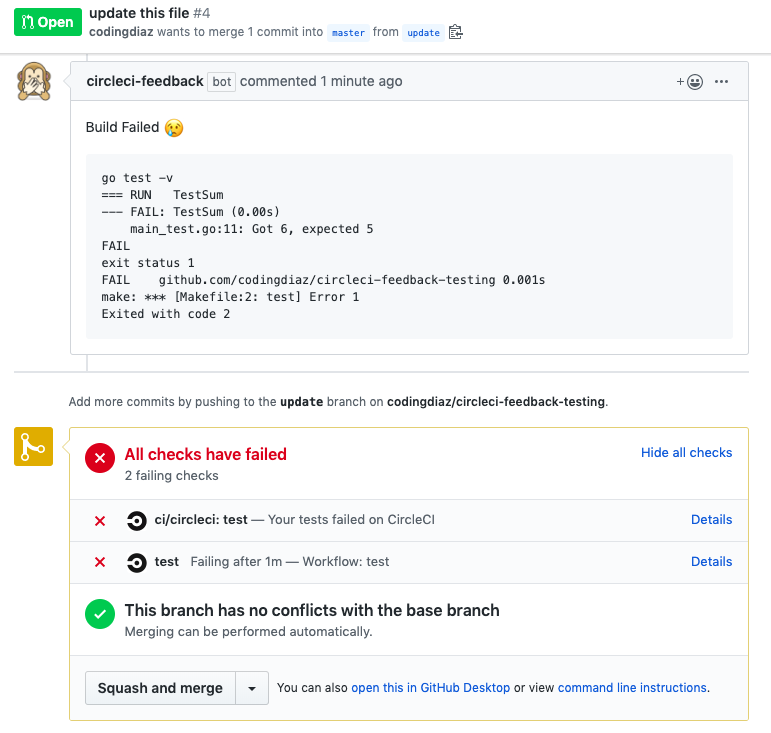

# circleci-feedback 

A Github app that posts build logs from failed CircleCI jobs to Pull Requests.

## Overview

CircleCI Feedback is a Github app that posts [CircleCI](https://circleci.com/) build logs back to your pull requests. This Github app aims to keep you in Github as much as possible so you can iterate on your favorite project faster.

Ready to use it? Checkout the [getting started guide](getting_started.md).

## Architecture
For each pull request event, a webhook is sent to API Gateway, the request is authorized and ultimately an [AWS Step Function](https://aws.amazon.com/step-functions/) is started. The step function runs very simple logic with Lambda functions and uses step function features to run this as cheap as possible. 